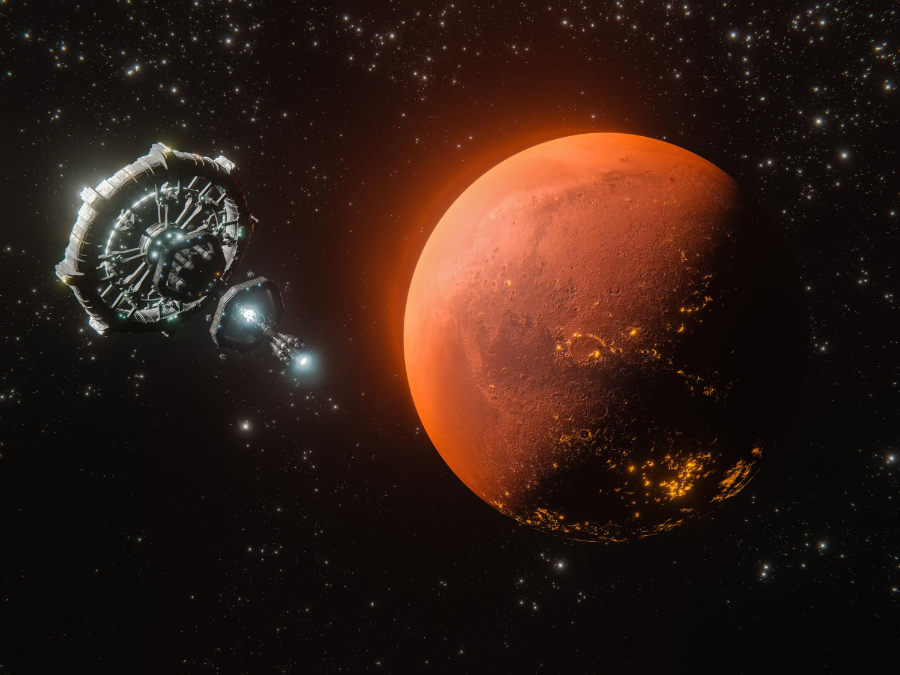
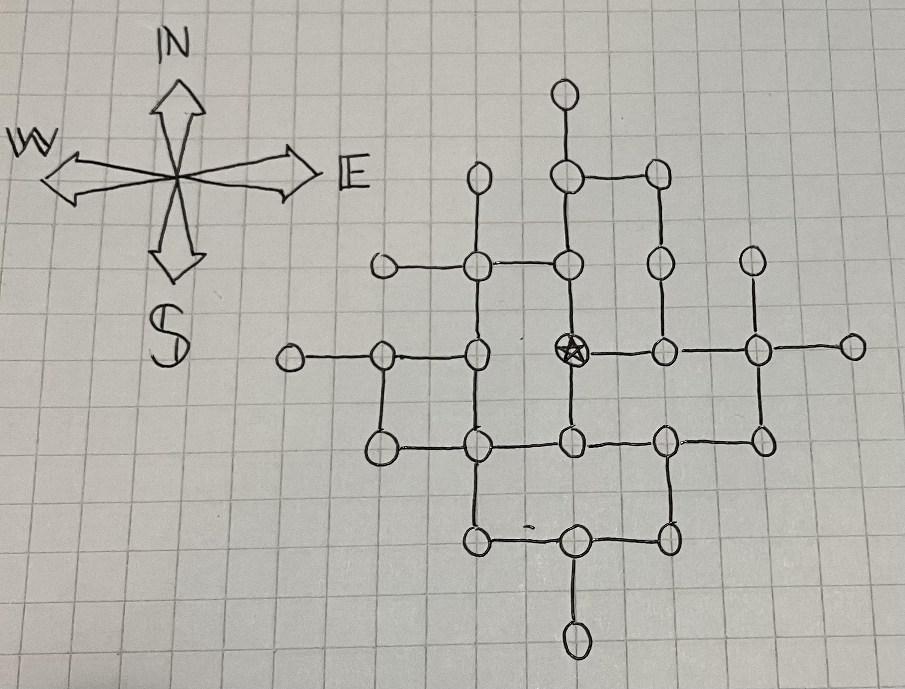

*Source: [FreePik](https://www.freepik.com/free-photo/3d-rendering-planet-mars-broadband-internet-system-meet-needs-consumers_29006459.htm#fromView=search&page=1&position=12&uuid=1755c36c-3d54-4f02-8219-3fbdba15837c)*

## About

This game was designed and written by Luka Vähäsarja and Oscar Escartin for Programming 1, a course at Aalto University.

## How to play

In this game, you must terraform a planet and seed it with microscopic life. In practice, this can be achieved buy using items bought from the in-game store.

You spawn on the space station but can descend to the planet's surface. This allows you to observe the procedurally generated biomes. However, that is not necessary to complete the game. 

To complete the game, you have to get the parametres to match the Earth's equivalents. Mean temperature should be around 294 kelvin, O2 concentration at around 0.2 and so on. 

## How to win

This version of the game comes with a demo planet. It can always be beaten by buy buying and using certain items before planting the bio-capsule. 

You should be able to beat the game using the following commands:

```
buy nuke 86
buy microbe-tank 4
buy nitrogen-load 14

use nuke 86
use microbe-tank 4
use nitrogen-load 14

buy bio-capsule 3
land
```

After this, you may deploy a bio-capsule (write "use bio-capsule"). If that fails, try again. The success is computed probabilistically.

## A map of the planet's surface


